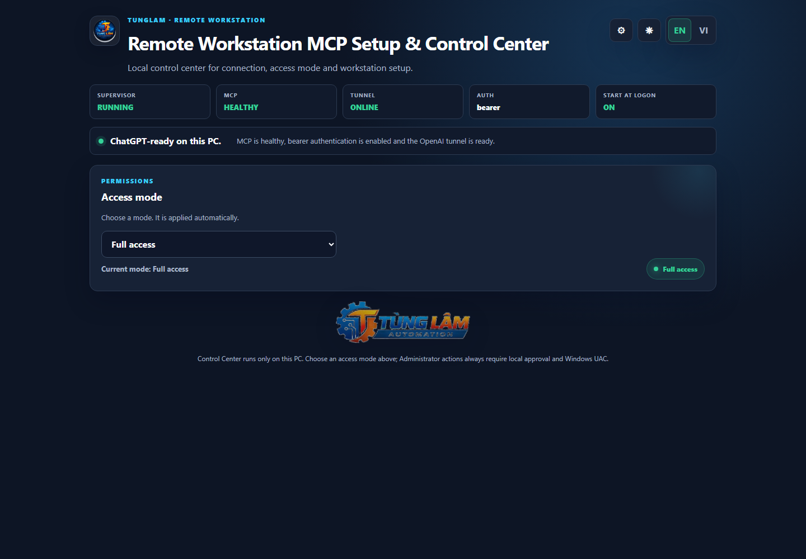
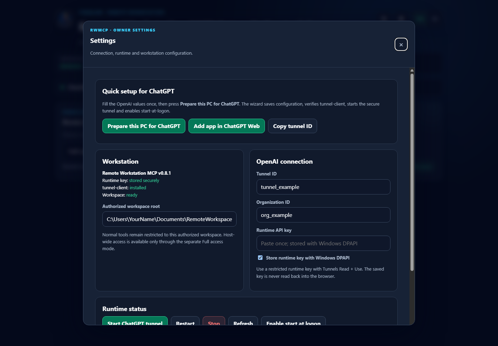
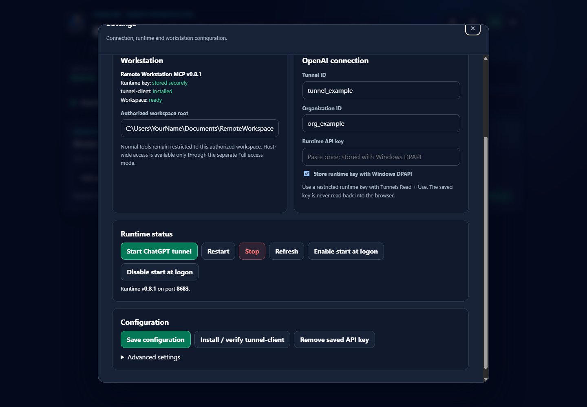
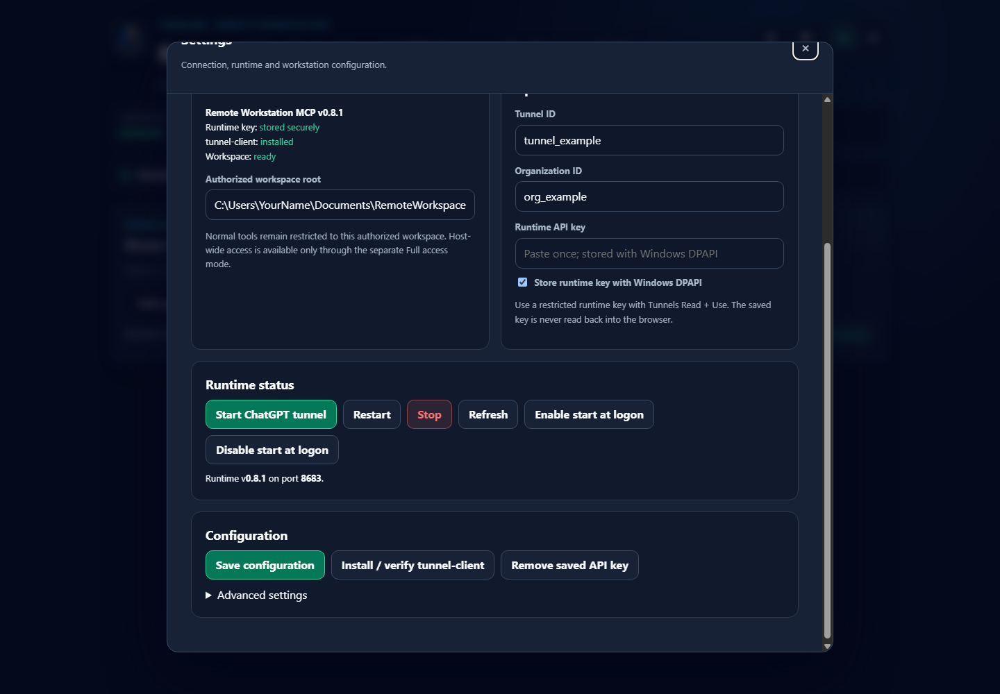
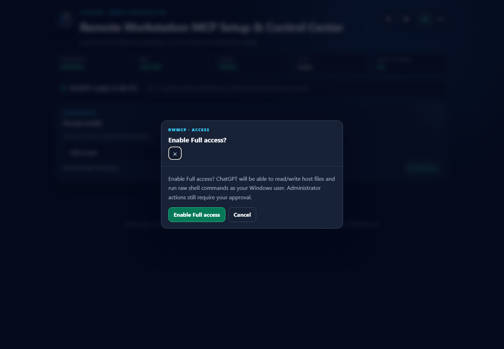
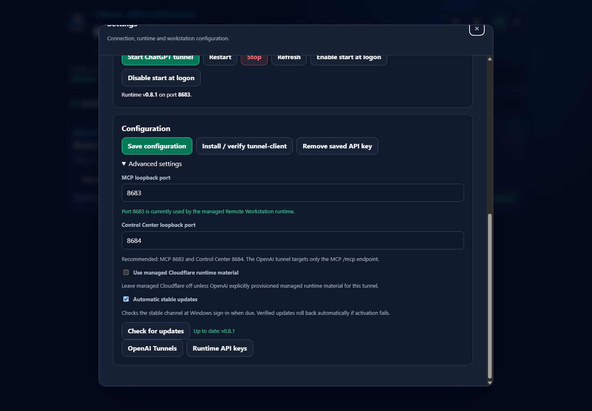

# Remote Workstation MCP

**Install once on each workstation. Connect each node directly to ChatGPT. No SSH hub required.**

Remote Workstation MCP (RWMCP) securely connects ChatGPT to Windows and Linux engineering workstations. Each machine can run as an independent Direct Node with its own outbound OpenAI Secure MCP Tunnel. The local owner decides what ChatGPT may read, modify, or execute, while the workstation MCP itself stays bound to loopback instead of being exposed directly to the Internet.

## Current release

**v0.9.4**

v0.9.4 hardens the Windows Control Center as the always-on local recovery plane:

- Boot starts the loopback Control Center before automatic updates or MCP/tunnel activation;
- recovery root selection falls back to the previous installed slot when the current slot is unusable;
- manual update and rollback ensure the Control Center is alive before stopping the managed runtime;
- the Control Center host now watchdog-restarts a crashed WebUI child with bounded 1/2/5/10/30 second backoff;
- Windows CI kills the WebUI child and verifies a replacement process restores HTTP health.

v0.9.3 hardens the STM32/OpenOCD provider contract without opening new dangerous debug surfaces:

- add `firmware_provider_status` for OpenOCD availability/version/capability preflight;
- allow an owner-controlled absolute `RWMCP_OPENOCD_EXECUTABLE` override so RWMCP can reuse pinned xPack/ST OpenOCD backends such as those used by B300 tooling without accepting executable paths from AI tool calls;
- add bounded `adapterSpeedKhz` (50..24000 kHz) to STM32 flash/verify/reset and debug-session startup;
- classify common OpenOCD failures into actionable codes such as probe missing/permission denied, target power/connect failure, verify failure, timeout and config missing;
- keep arbitrary TCL, mass erase, Option Bytes, readout-protection changes, memory write and GDB flash unavailable;
- CI/provider simulation is accepted on Windows/Linux; real ST-Link target acceptance remains a separate hardware gate because the current Ubuntu nodes have no probe attached.

v0.9.2 makes Windows managed updates durable across the runtime/tunnel restart boundary:

- Control Center hands an owner-approved install to a detached update worker instead of awaiting the update inside the MCP runtime request path;
- the worker persists `STARTING / RUNNING / SUCCEEDED / FAILED` transaction state and a local update log outside version slots;
- failed activation performs a best-effort `StartOpenAI` recovery on the current/rolled-back slot;
- OpenAI activation now allows 180 seconds while the supervisor may recycle an unhealthy first tunnel child after 60 seconds;
- Windows CI simulates both successful slot activation and failed-update recovery through the real PowerShell handoff script.

v0.9.1 hardens Windows post-update tunnel recovery:

- tunnel readiness now requires a recent successful OpenAI control-plane poll, not only local `/readyz`;
- the Windows watchdog detects stale control-plane polling and automatically recycles the managed tunnel runtime with bounded backoff;
- runtime start/update health gates wait for a fresh poll before declaring the Direct Node online;
- Windows CI validates the Prometheus poll metric parser and the new recovery contract.

v0.9.0 introduces the first typed engineering-tool layer for Remote Workstation MCP:

- true PTY/ConPTY sessions and bounded serial I/O;
- hardware discovery plus exclusive ST-Link/serial resource leases;
- typed firmware project inspection, build, flash-plan, flash, verify and reset workflows;
- constrained OpenOCD + GDB/MI debugging with stack/register/variable/breakpoint/memory-read/fault diagnostics;
- ESP-IDF provider activation, ROS 2 typed workflows and Docker/container typed workflows;
- project/workspace containment, authenticated scope classification and separate hardware-mutation/serial-write policy gates;
- pinned native dependencies and packed-artifact smoke coverage for managed installs.

Raw shell remains an explicitly elevated escape hatch. v0.9.0 intentionally does not expose mass erase, STM32 Option Bytes, ESP eFuse writes, arbitrary OpenOCD/GDB commands, target memory writes or GDB flashing.

See `docs/ENGINEERING_TOOLS.md` for the tool families and safety model.

## Recover an expired/revoked key or changed tunnel

The local Control Center is intentionally independent from the OpenAI tunnel. Even when ChatGPT cannot reach the workstation, open locally:

```text
http://127.0.0.1:8684
```

Then open **Settings -> OpenAI connection**:

1. replace the Tunnel ID only if it actually changed;
2. paste a new restricted Runtime API key with **Tunnels Read + Use**;
3. choose **Test credentials**;
4. when verification succeeds, choose **Save & reconnect**.

The saved key is protected with current-user Windows DPAPI and is never read back into the browser. A failed or unavailable MCP runtime is shown as `OFFLINE`/`RECOVERY`; it must not prevent the local Control Center from loading.

## New user path: from zero to READY

A first-time user only needs to complete this flow once:

```text
Download installer
      -> install RWMCP
      -> create OpenAI Secure MCP Tunnel
      -> create restricted Runtime API key
      -> enter Tunnel ID + Organization ID + API key in Control Center
      -> Prepare this PC for ChatGPT
      -> add the custom MCP app in ChatGPT Web
      -> verify chatgpt_web_status
      -> READY
```

After that, RWMCP starts with Windows and maintains the tunnel automatically.

## 1. Download the Windows installer

Open the latest GitHub Release and download `install-windows.cmd`.

The current stable release contains:

- `install-windows.cmd`
- `install-windows.ps1`
- `remote-workstation-mcp-v0.9.3.tgz`
- `SHA256SUMS.txt`


Double-click `install-windows.cmd`. The installer checks prerequisites, downloads the verified release package, installs the runtime and OpenAI tunnel client, creates the stable launcher, configures startup, initializes automatic patch updates, and opens the local Control Center.

Normal users do **not** need to clone this repository or run `npm install`.

## 2. Create an OpenAI Secure MCP Tunnel

RWMCP keeps the workstation MCP on `127.0.0.1`. ChatGPT reaches it through an outbound OpenAI Secure MCP Tunnel.

Open OpenAI Platform **Tunnels**:

`https://platform.openai.com/settings/organization/tunnels`

Create a tunnel for this workstation, for example `Remote Workstation - Engineering PC`, then copy the generated ID:

```text
tunnel_xxxxxxxxxxxxxxxxxxxxxxxxxxxxxxxx
```

The account/role creating or managing the tunnel needs the relevant **Tunnels Read + Manage** permission. The runtime user that will operate the tunnel needs **Tunnels Read + Use**.

> Keep each production workstation on its own tunnel when practical. It gives cleaner revocation, auditing, and failure isolation.

## 3. Create the Runtime API key

Open OpenAI Platform **Runtime API keys**:

`https://platform.openai.com/settings/organization/api-keys`

Create a **Restricted** runtime key and grant only:

- **Tunnels: Read**
- **Tunnels: Use**

Copy the key once and keep it private.

Do **not** use an OpenAI Admin API key as the long-lived RWMCP runtime key. Admin keys are only needed for administrative tunnel CRUD workflows.

## 4. Configure the local Control Center

The Control Center opens locally at:

```text
http://127.0.0.1:8684
```



Open **Settings**.



Enter:

1. **Authorized workspace root** - the folder normal Workspace-mode tools may access.
2. **Tunnel ID** - the `tunnel_...` value created above.
3. **Organization ID** - when your tunnel/account is organization-scoped or the account can address multiple organizations.
4. **Runtime API key** - the restricted Tunnels Read + Use key.
5. Keep **Store runtime key with Windows DPAPI** enabled for normal managed Windows use.



Then choose **Prepare this PC for ChatGPT**.

The wizard saves the non-secret configuration, protects the runtime key with Windows DPAPI, verifies `tunnel-client`, starts MCP + the Secure MCP Tunnel, waits for readiness, and enables start-at-logon.



## 5. Add Remote Workstation to ChatGPT Web

OpenAI currently calls this a **custom MCP app**. Older UI or documentation may call it a connector or plugin.

Current OpenAI documentation places custom MCP app setup under **ChatGPT Settings / Workspace Settings -> Apps**. Developer Mode may need to be enabled first, depending on the workspace and plan.

Typical flow:

1. Open ChatGPT Web.
2. Open **Settings -> Apps**.
3. Enable **Developer Mode** if your workspace requires it.
4. Choose **Create** / **Add custom app**.
5. Name it **Remote Workstation**.
6. Choose the **Tunnel** connection type.
7. Select the authorized tunnel or paste the same `tunnel_...` ID configured in RWMCP.
8. Keep the workstation Control Center in READY state while ChatGPT performs MCP discovery.
9. Review the discovered RWMCP tools before publishing or enabling the app for other users.

Direct settings entry point currently used by OpenAI:

`https://chatgpt.com/#settings/Connectors`

Product UI and plan availability can change independently of RWMCP. As of September 2026, OpenAI documents full MCP write/modify support on ChatGPT Web for Business, Enterprise and Edu workspaces; Pro has more limited developer-mode MCP support. Check the current OpenAI Developer Mode documentation before a wider deployment.

Detailed guide: [ChatGPT Web custom app setup](docs/CHATGPT_WEB.md).

## 6. Verify the end-to-end connection

When the workstation is configured correctly, the Control Center shows MCP healthy, tunnel READY, bearer authentication enabled, and start-at-logon ON.


In ChatGPT, invoke the Remote Workstation app and ask:

> Use Remote Workstation. Call `chatgpt_web_status` first. Do not modify anything. Report whether the authenticated control path is verified, the effective scopes, policy mode and authorized workspace names.

A healthy result includes:

```text
ok: true
chatgptWeb.authenticated: true
chatgptWeb.secureTunnelPrincipal: true
chatgptWeb.directControlPathVerified: true
```

Then verify `workspace_list` before allowing writes or execution.

## Access modes

RWMCP exposes exactly three owner-selected access modes:

| Mode | Meaning |
| --- | --- |
| **Read only** | Inspect files, Git state, status, and diagnostics. No writes or program execution. |
| **Workspace** | Read, write, and execute approved workflows inside owner-authorized workspaces. Recommended default. |
| **Full access** | Host filesystem and raw shell using the permissions of the current Windows user. |

**Full Access is not Administrator.**

Administrator execution is a separate one-shot path:

```text
AI request
   -> local owner approval in Control Center
   -> Windows RunAs / UAC
   -> one approved privileged execution
```



A mode change cannot silently grant Administrator rights.

## After first setup

After the first successful setup, you do **not** need to:

- run the installer again;
- clone the repository;
- run `git pull`;
- run `npm install` or `npm build`;
- launch PowerShell manually on each boot;
- recreate the tunnel after every restart;
- re-enter the runtime API key after each update.

RWMCP automatically:

- starts after the Windows user signs in;
- starts the MCP runtime;
- reconnects the OpenAI Secure MCP Tunnel;
- keeps owner configuration and DPAPI-protected secrets outside version slots;
- checks the stable release channel when due;
- downloads and SHA-256 verifies release packages;
- installs updates into a new version slot;
- verifies MCP health and tunnel readiness;
- automatically rolls back to the previous slot when candidate activation fails.

Windows startup uses:

```text
HKCU\Software\Microsoft\Windows\CurrentVersion\Run
        |
        v
%LOCALAPPDATA%\RemoteWorkstationMCP\bin\rwmcp.ps1 -Action Boot
        |
        +--> check stable update when due
        +--> start runtime
        +--> start OpenAI tunnel
        +--> verify health/readiness
```

## Automatic patch updates

Advanced settings exposes **Automatic patch updates** and **Check for updates**.




Managed defaults:

```text
enabled            = true
channel            = stable
checkOnStartup     = true
checkIntervalHours = 12
```

Production updates come from GitHub Releases. RWMCP does not `git pull` a production source tree. It downloads the release package and checksum manifest, verifies SHA-256, installs a new slot, switches the active pointer, validates health/readiness, and rolls back automatically on failure.

Managed policy: patch releases (`x.y.Z`) may install automatically; minor/major releases are detected and require explicit owner approval. A manual owner-approved update may install any newer stable release.

## Managed Windows layout

```text
%LOCALAPPDATA%\RemoteWorkstationMCP\
  bin\
    rwmcp.ps1
    install-windows-release.ps1
    update-windows.ps1
  config\
  runtime\
    update-transaction.json
    update-worker.log
  secrets\
  versions\
    v0.7.9\
    v0.8.1\
  current.txt
  previous.txt
  update.json
  settings.json
  audit.jsonl
```

The stable launcher resolves `current.txt`, so startup follows the active version automatically after an update or rollback.

## v0.7.10 Control Center port ownership hardening

The default Control Center port is `8684`. v0.7.10 verifies that the listener on that port belongs to the managed Control Center process tree before reporting it healthy.

If another process owns `8684`, RWMCP does not report a false READY state. It reports the conflicting PID so the owner can close the application or choose another Control Center port in Advanced settings.

## Documentation

- [Multi-device Hub](docs/MULTI_DEVICE.md)
- [Windows quick start](docs/QUICKSTART_WINDOWS.md)
- [ChatGPT Web custom app setup](docs/CHATGPT_WEB.md)
- [OpenAI Secure MCP Tunnel](docs/OPENAI_SECURE_TUNNEL.md)
- [Windows managed runtime](docs/WINDOWS.md)
- [Setup & Control Center](docs/SETUP_CONSOLE.md)
- [Operations](docs/OPERATIONS.md)
- [Security](docs/SECURITY.md)
- [Architecture](docs/ARCHITECTURE.md)

## Development setup

The Git workflow below is for contributors only; it is not required for a normal installed workstation.

```powershell
git clone https://github.com/Tunglam0605/remote-workstation-mcp.git
cd remote-workstation-mcp
npm install
npm run typecheck
npm test
npm run build
```

## License

Apache-2.0
