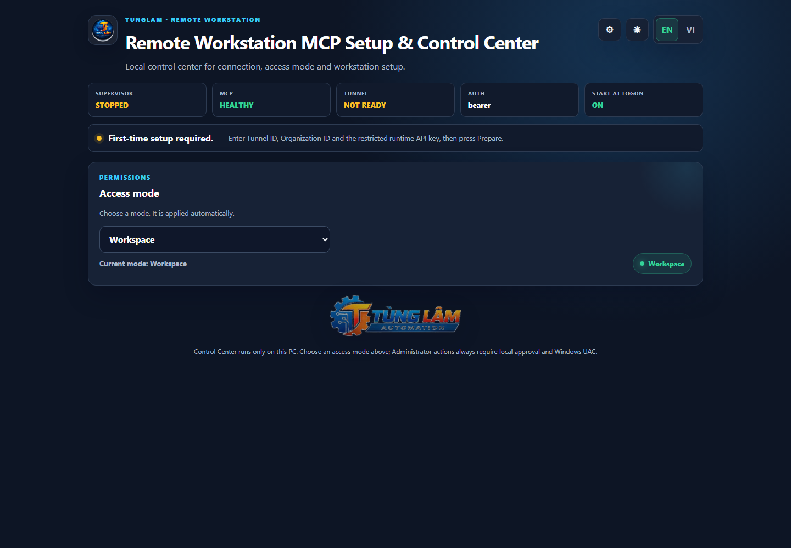
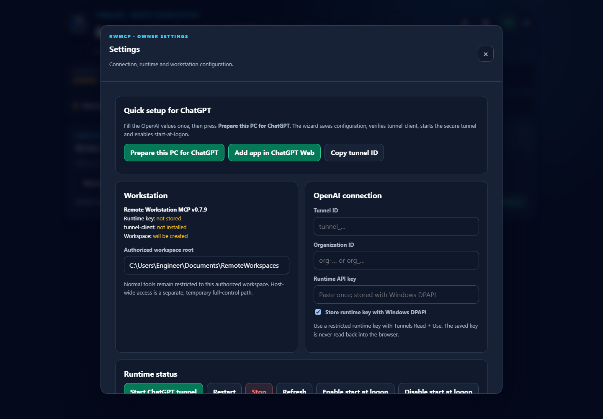
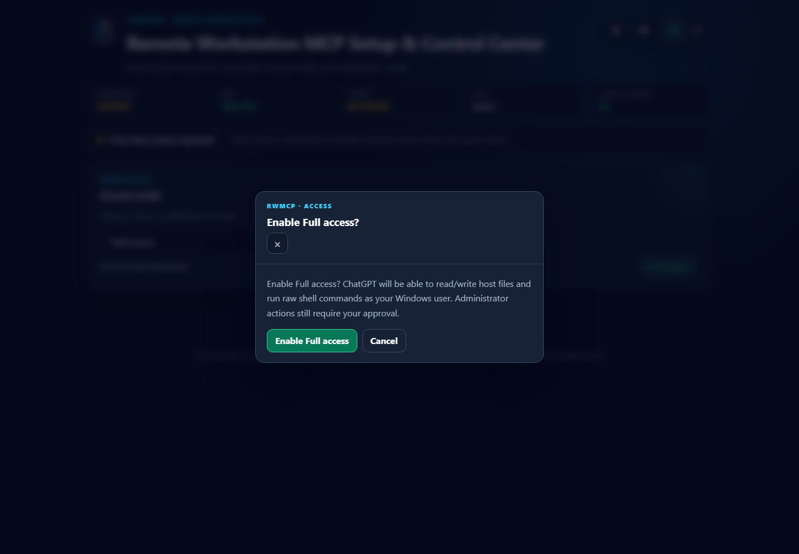

# Windows quick start — install once

Remote Workstation MCP v0.7.10 is designed for a one-time workstation setup:

1. install once;
2. enter the owner-specific OpenAI/tunnel values once;
3. choose **Prepare this PC for ChatGPT** once;
4. from then on RWMCP starts after Windows sign-in, reconnects the secure tunnel, and checks the stable update channel automatically.

The workstation MCP remains bound to loopback. ChatGPT reaches it through OpenAI Secure MCP Tunnel; no inbound router/firewall port is required.

## 1. Download the Windows bootstrap

From the latest GitHub Release download:

```text
install-windows.cmd
```

Double-click the file. It downloads the PowerShell installer and checksum manifest, verifies SHA-256, then continues with the managed installation.

PowerShell fallback:

```powershell
$installer = Join-Path $env:TEMP 'rwmcp-install-windows.ps1'
Invoke-WebRequest `
  'https://github.com/Tunglam0605/remote-workstation-mcp/releases/latest/download/install-windows.ps1' `
  -OutFile $installer `
  -UseBasicParsing
powershell.exe -NoLogo -NoProfile -ExecutionPolicy Bypass -File $installer
```

The installer automatically:

- installs Node.js LTS and Git through `winget` when missing;
- downloads the latest stable RWMCP release;
- verifies the release package against `SHA256SUMS.txt`;
- installs into `%LOCALAPPDATA%\RemoteWorkstationMCP\versions\vX.Y.Z`;
- installs/verifies the pinned OpenAI `tunnel-client`;
- creates a stable launcher and Start Menu shortcut;
- initializes stable auto-update;
- opens the local Control Center.

## 2. First-time Control Center setup

The daily dashboard is intentionally compact:



Open **Settings** and configure only the owner-specific values:

- authorized workspace root;
- OpenAI Tunnel ID;
- Organization ID when applicable;
- restricted runtime API key with the required tunnel permissions.

Keep secure DPAPI storage enabled unless you have a specific reason not to.



Choose **Prepare this PC for ChatGPT**. The wizard then saves configuration, protects the key with current-user Windows DPAPI, verifies the tunnel client, starts MCP + tunnel, waits for health/readiness, and enables start-at-logon.

A ready state means the workstation-side setup is complete.

## 3. Access mode

Use the mode selector instead of configuring scopes manually:

- **Read only** — inspect only;
- **Workspace** — normal read/write/execute inside the authorized workspace;
- **Full access** — host filesystem + raw shell at the current Windows user level.

Selecting Full access requires explicit confirmation:



Full access is not Administrator. Privileged operations remain request-only until the local owner approves the exact request and accepts Windows UAC.

## 4. Add/select the app in ChatGPT

Use the Tunnel ID from the Control Center when adding/selecting the Remote Workstation MCP app in ChatGPT. Product/workspace-side app availability and approval are controlled by ChatGPT/OpenAI rather than the local installer.

See:

- [ChatGPT Web setup](CHATGPT_WEB.md)
- [End-to-end acceptance](CHATGPT_WEB_CONTROL.md)
- [OpenAI Secure MCP Tunnel](OPENAI_SECURE_TUNNEL.md)

## 5. Daily use after the first setup

You should not need to reopen PowerShell or rerun setup.

At Windows sign-in:

```text
stable launcher
   ↓
check stable update when due (maximum once per 12 h)
   ↓
install new version slot if available
   ↓
start MCP + OpenAI tunnel
   ↓
health/readiness check
   ↓
READY
```

If the update check cannot reach GitHub, the installed version still starts. If a newly installed version fails to become healthy/ready, the stable launcher rolls back to the previous version and starts the known-good slot. The failed release is temporarily backed off rather than installed again on every sign-in.

Auto-update state is stored outside version slots, alongside owner configuration. Updating does not erase:

- workspace selection;
- access mode/policy;
- Tunnel ID / Organization ID;
- DPAPI-protected runtime key;
- SSH hosts;
- audit data.

## Additional PCs

Run the same one-time installer on each workstation. Treat each PC as its own security boundary and normally give it its own tunnel/runtime key so device revocation, audit and failure isolation remain clear.

## Troubleshooting

Open the stable Control Center from the Start Menu or browse to:

```text
http://127.0.0.1:8684/
```

The MCP browser root also redirects locally:

```text
http://127.0.0.1:8683/
```

Stable launcher:

```powershell
$ctl = "$env:LOCALAPPDATA\RemoteWorkstationMCP\bin\rwmcp.ps1"
& $ctl -Action Status
& $ctl -Action Setup
& $ctl -Action UpdateCheck
& $ctl -Action Update
& $ctl -Action Rollback
```

For deeper diagnostics see [Windows operations](WINDOWS.md) and [Setup & Control Center](SETUP_CONSOLE.md).
