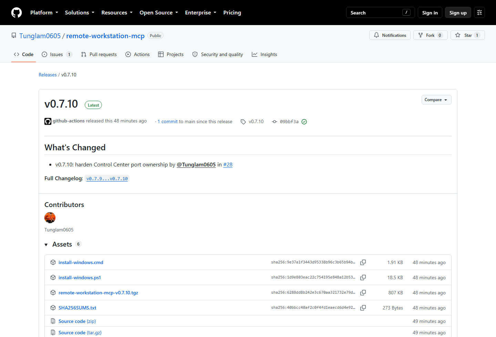

# Windows quick start - one-time setup

This guide takes a new Windows PC from no installation to a ChatGPT-ready Remote Workstation MCP v0.7.10.

## Before you start

You need:

- Windows 10/11;
- access to the latest RWMCP GitHub Release;
- an OpenAI Platform organization/workspace that can use Secure MCP Tunnel;
- a ChatGPT workspace/account that exposes the custom MCP app flow required for your use case.

## 1. Download the installer

From the latest GitHub Release, download `install-windows.cmd`.

Double-click it. The installer handles the production runtime, tunnel client, stable launcher, startup entry, and stable auto-update initialization.

## 2. Create the OpenAI tunnel

Open:

`https://platform.openai.com/settings/organization/tunnels`

Create a tunnel for this workstation and copy its `tunnel_...` ID.

Tunnel managers need the relevant Tunnels Read + Manage permission. Runtime users need Tunnels Read + Use.

## 3. Create the restricted Runtime API key

Open:

`https://platform.openai.com/settings/organization/api-keys`

Create a **Restricted** runtime key with:

- Tunnels Read
- Tunnels Use

Do not use a long-lived Admin API key for RWMCP runtime operation.

## 4. Open the Control Center

The managed installer opens:

`http://127.0.0.1:8684`

Open **Settings**.

## 5. Configure the connection

Enter the authorized workspace, Tunnel ID, Organization ID when applicable, and the restricted Runtime API key.

Keep Windows DPAPI storage enabled for the normal managed installation and choose **Prepare this PC for ChatGPT**.

The wizard verifies the tunnel client, starts the runtime, waits for tunnel readiness, and enables start-at-logon.

## 6. Add the custom MCP app to ChatGPT Web

Open ChatGPT Web and use the current **Settings -> Apps** / custom app flow. Depending on the workspace, enable **Developer Mode** first.

Create an app named **Remote Workstation**, choose **Tunnel**, and select or paste the same `tunnel_...` ID.

Keep the workstation READY during discovery. Review the discovered tools before enabling the app broadly.

See [ChatGPT Web custom app setup](CHATGPT_WEB.md) for current plan notes and a detailed walkthrough.

## 7. Choose an access mode

Use **Workspace** for normal engineering work.

- **Read only**: inspect only.
- **Workspace**: read/write/execute within authorized workspaces.
- **Full access**: host filesystem + raw shell as the current Windows user.

Full access is **not** Administrator.

## 8. Verify READY

The green READY state means MCP health, bearer authentication, and tunnel readiness have passed.

In ChatGPT, call `chatgpt_web_status` first, then `workspace_list`.

## 9. Reboot test

Restart Windows or sign out/in once. RWMCP should return automatically without rerunning setup.

Startup uses the current-user registry `Run` key and the stable launcher `rwmcp.ps1 -Action Boot`.

## 10. From now on

You do not need to rerun the installer, `git pull`, `npm install`, rebuild RWMCP, reopen PowerShell on every boot, or recreate the tunnel after each restart.

Automatic stable updates are enabled by default and checked at startup when due.

If a newly installed release fails MCP/tunnel health verification, RWMCP automatically returns to the previous known-good slot.

For deeper Windows diagnostics see [Windows runtime](WINDOWS.md) and [Setup & Control Center](SETUP_CONSOLE.md).
