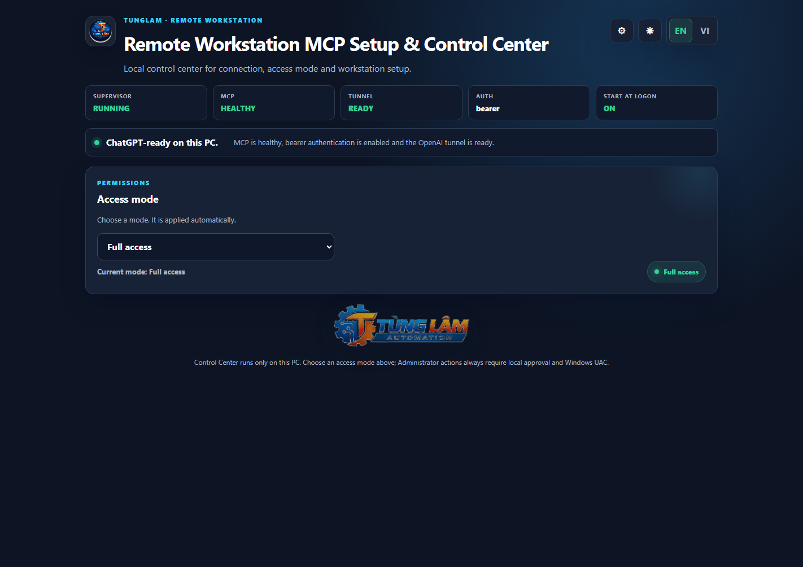
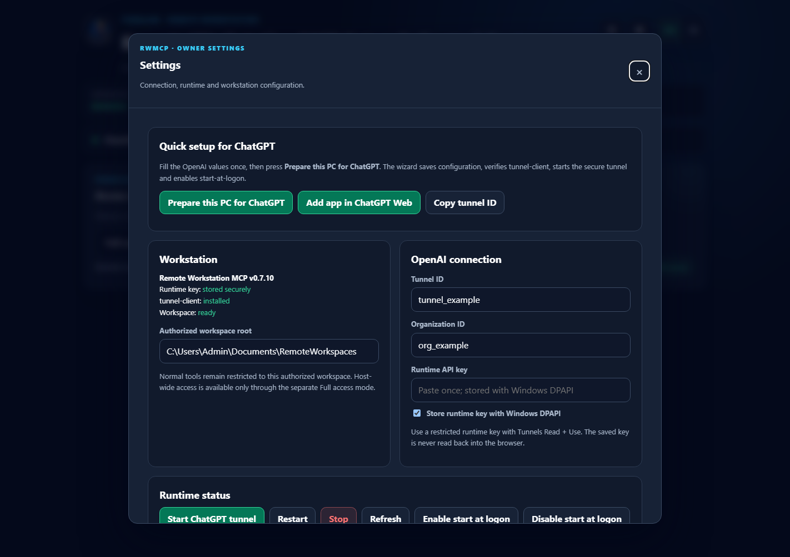
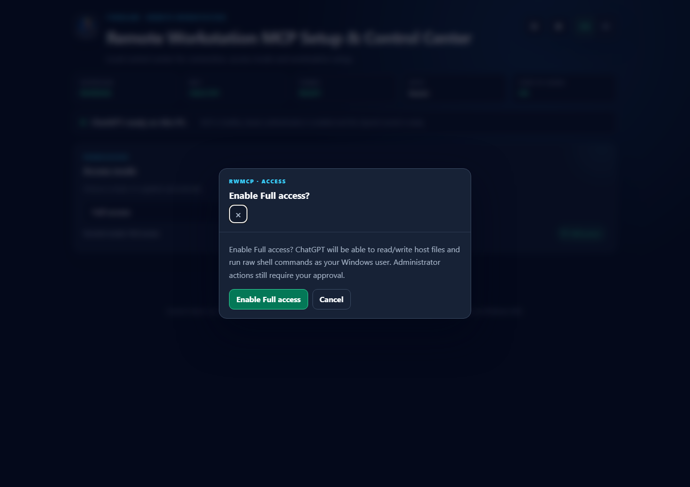
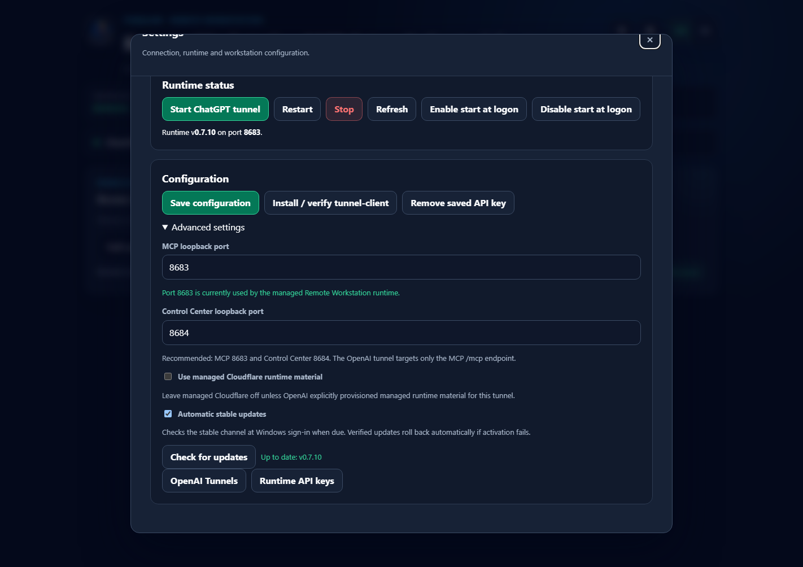

# Windows quick start - install once

Remote Workstation MCP v0.7.10 is designed so a new Windows PC needs one setup session. After that, RWMCP starts with Windows sign-in and keeps itself on the stable release channel.

## 1. Download the installer

**Goal:** get the one-time bootstrap.

From the latest GitHub Release, download:

```text
install-windows.cmd
```

Double-click it. The bootstrap verifies the PowerShell installer before the managed installation continues.

## 2. Run the installer

**Goal:** install the production runtime without cloning the repository.

The installer checks prerequisites, downloads and SHA-256-verifies the stable release, installs it under `%LOCALAPPDATA%\RemoteWorkstationMCP`, installs/verifies the OpenAI tunnel client, creates the stable launcher, configures startup/auto-update, and opens the Control Center.

## 3. Confirm the Control Center opens

**Goal:** verify the local owner UI is running.

Open `http://127.0.0.1:8684` if it did not open automatically.



The page should show Connection status, Access mode, and the Settings button.

## 4. Open Settings

**Goal:** enter the few values that are specific to this PC/owner.

Open **Settings** and use **Quick setup for ChatGPT**.



Configure the authorized workspace root, Tunnel ID, Organization ID when applicable, and the restricted runtime API key. Leave Windows DPAPI storage enabled unless you intentionally manage the key another way.


Choose **Prepare this PC for ChatGPT**. The wizard saves configuration, verifies `tunnel-client`, starts the secure tunnel, waits for readiness, and enables start-at-logon.

## 5. Select the access mode

**Goal:** choose the least privilege needed for daily work.

- **Read only** - view/inspect only.
- **Workspace** - read/write/execute approved workflows inside authorized workspaces.
- **Full access** - host filesystem + raw shell as the current Windows user.

Full Access is **not** Administrator. Selecting it requires confirmation.



Administrator actions use a separate flow: AI request -> local owner approval -> Windows UAC -> one-shot privileged execution.

## 6. Verify READY

**Goal:** confirm the workstation side is complete.

A ready system shows MCP healthy, tunnel ready, bearer authentication enabled, and start-at-logon ON.


## 7. Check automatic updates

**Goal:** verify maintenance is automatic.

Open **Settings > Configuration > Advanced settings**. `Automatic stable updates` is enabled by default and `Check for updates` is available for an owner-triggered check.



Defaults are stable channel, startup checks enabled, and a 12-hour check interval.

## 8. Close the window or reboot once

**Goal:** prove that daily use does not require setup again.

You can close the Control Center browser window. RWMCP is supervised separately.

At the next Windows sign-in the current-user startup entry runs:

```text
%LOCALAPPDATA%\RemoteWorkstationMCP\bin\rwmcp.ps1 -Action Boot
```

`Boot` checks for a stable update when due, starts the MCP runtime, reconnects the OpenAI tunnel, and verifies health/readiness.

After the first setup you do **not** need to rerun the installer, run `git pull`, run `npm install`, rebuild the project, reopen PowerShell, or configure the tunnel every time Windows starts.

## If something is not READY

Run:

```powershell
$ctl = "$env:LOCALAPPDATA\RemoteWorkstationMCP\bin\rwmcp.ps1"
& $ctl -Action Status
```

Then see [Windows runtime](WINDOWS.md) and [Setup & Control Center](SETUP_CONSOLE.md).