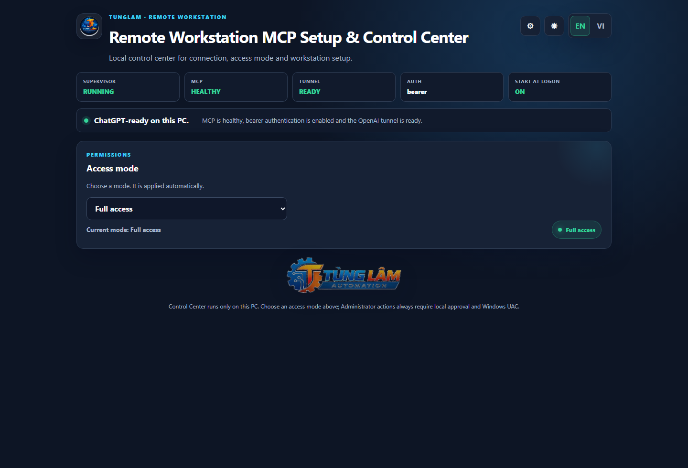
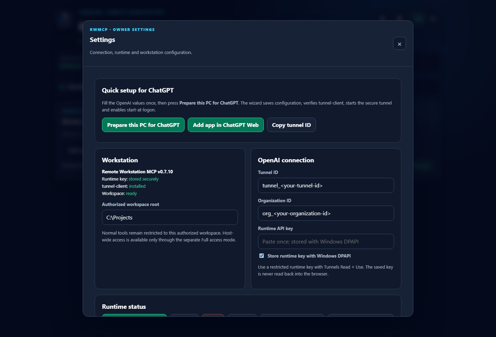
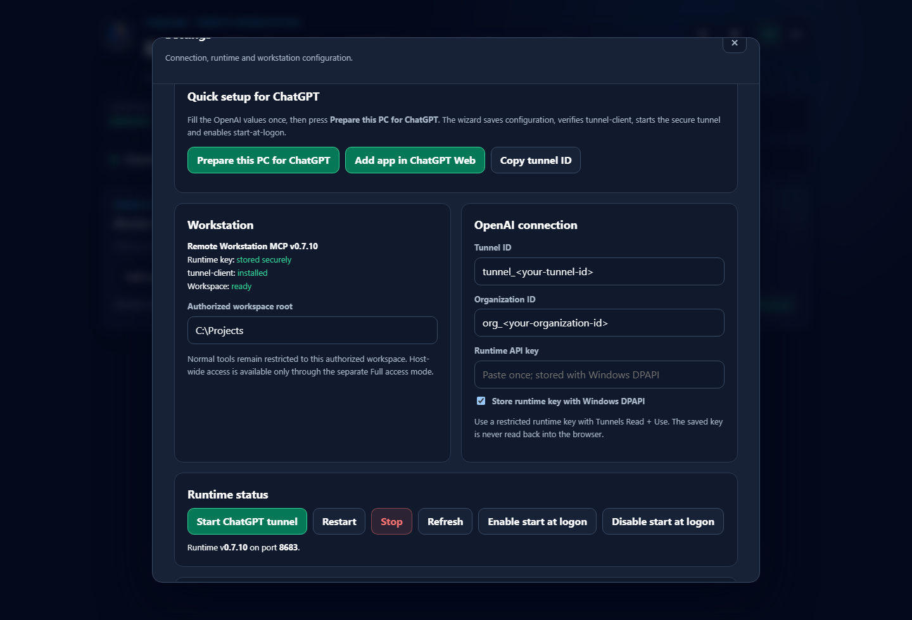
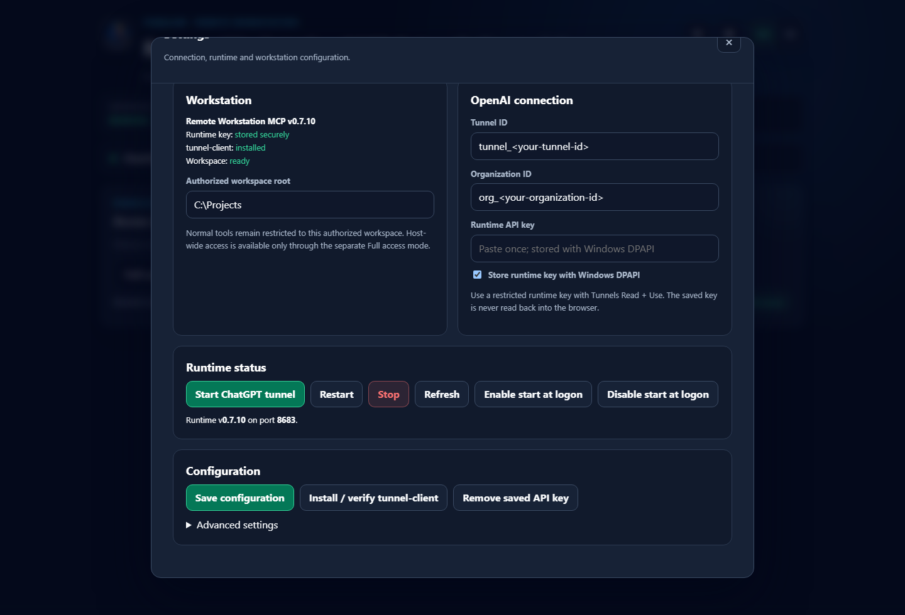
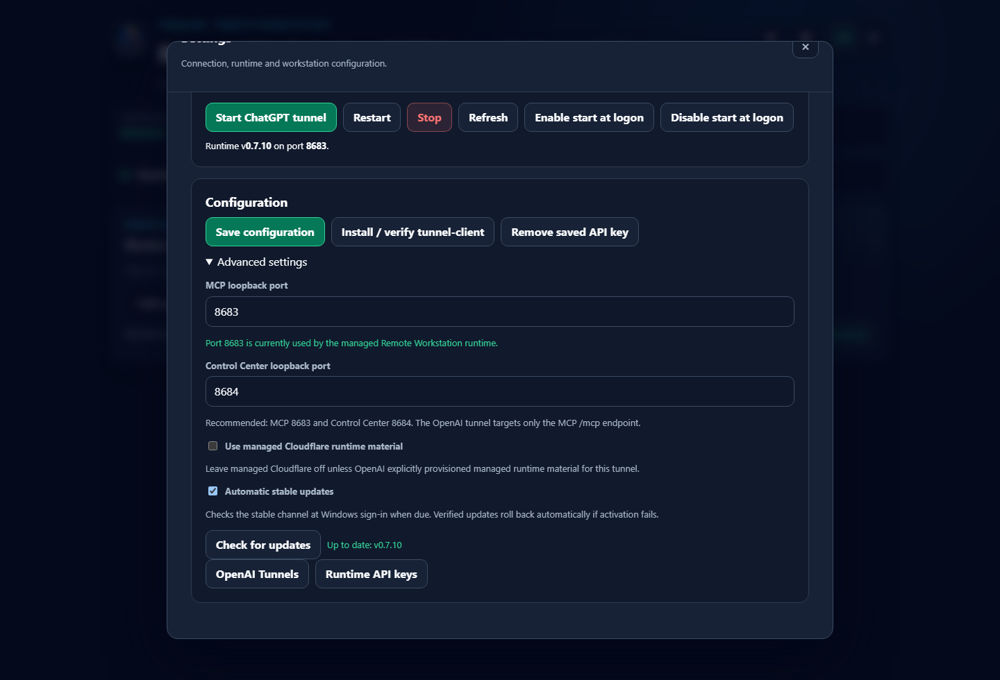
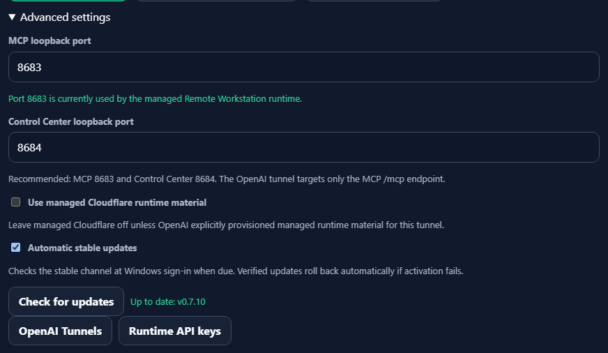
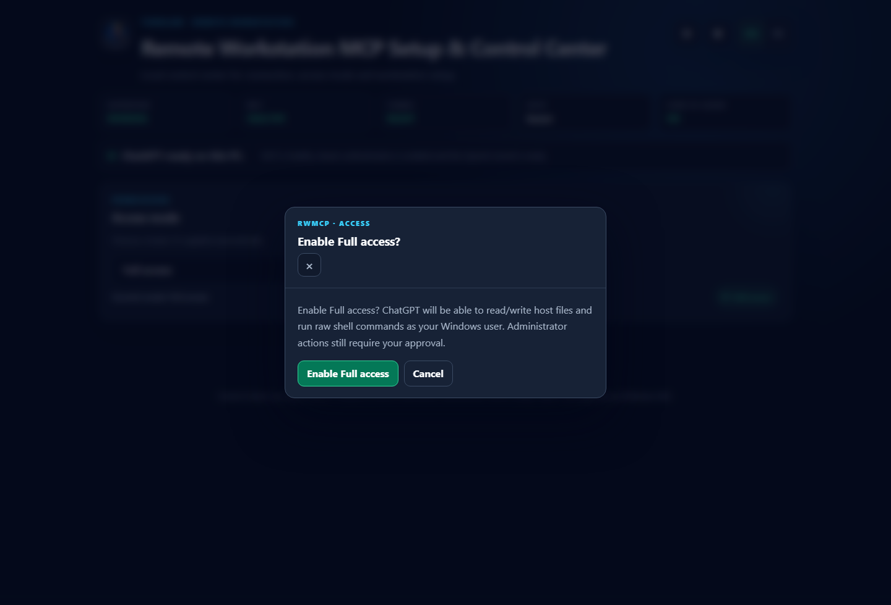

# Setup & Control Center

Remote Workstation MCP v0.7.10 includes a loopback-only owner Control Center for first-time setup, runtime operations, access-mode selection, updates, and one-shot Administrator approval.

## Endpoints

Default managed Windows ports:

- MCP: `127.0.0.1:8683`
- Control Center: `127.0.0.1:8684`

Browser navigation to the MCP root can redirect locally to the Control Center, while the OpenAI tunnel targets only the MCP `/mcp` endpoint.

## Production UI

The daily dashboard exposes three primary concepts:

- **Connection** status;
- **Access mode**;
- **Settings**.



The v0.7.10 production Settings modal currently contains these sections, in one scrollable modal:

1. **Quick setup for ChatGPT**
2. **Workstation**
3. **OpenAI connection**
4. **Runtime status**
5. **Configuration**
6. **Advanced settings**









## First-time setup

For a new Windows PC:

1. run the one-time GitHub Release installer;
2. open Settings;
3. set the authorized workspace root;
4. enter the OpenAI Tunnel ID;
5. enter Organization ID when applicable;
6. paste the restricted runtime API key;
7. keep Windows DPAPI storage enabled unless you intentionally manage secrets another way;
8. choose **Prepare this PC for ChatGPT**.

The quick setup flow saves configuration, protects the runtime key with current-user Windows DPAPI, installs/verifies `tunnel-client`, starts OpenAI mode, waits for runtime/tunnel readiness, and enables start-at-logon.

The saved API key is not read back into the browser.

## Runtime controls

The Runtime status section provides owner-local actions for:

- Start ChatGPT tunnel;
- Restart;
- Stop;
- Refresh;
- Enable start at logon;
- Disable start at logon.

These are local Control Center actions, not arbitrary MCP command execution.

## Advanced settings

Advanced settings includes:

- MCP loopback port;
- Control Center loopback port;
- managed runtime option;
- **Automatic stable updates**;
- **Check for updates**.



Managed Windows defaults to stable automatic updates, startup checks, and a 12-hour check interval.

## Access modes

The Control Center exposes exactly three access modes:

### Read only

Inspect-only mode. No workspace writes or program execution.

### Workspace

Normal engineering mode. Read, write, and execute approved workflows inside owner-authorized workspaces.

### Full access

Enables host filesystem and raw shell using the permissions of the current Windows user.

Selecting Full access requires explicit local confirmation.



**Full Access != Administrator.**

## Administrator approval

Administrator is not an access mode.

The one-shot privileged path is:

```text
AI request
  -> pending Administrator request
  -> local owner reviews exact program/arguments/reason
  -> owner chooses Allow once
  -> Windows RunAs/UAC
  -> isolated helper verifies the approved request binding
  -> one direct privileged execution
```

The normal MCP/tunnel/Control Center stays non-elevated. A mode switch never grants Administrator rights.

## Start at logon

Managed v0.7.10 uses the current-user registry:

```text
HKCU\Software\Microsoft\Windows\CurrentVersion\Run
```

The entry points at:

```text
%LOCALAPPDATA%\RemoteWorkstationMCP\bin\rwmcp.ps1 -Action Boot
```

`Boot` performs a throttled stable update check when due, starts OpenAI mode, then verifies runtime health/readiness.

## Stable launcher actions

The v0.7.10 stable launcher implements:

| Action | Purpose |
| --- | --- |
| `Setup` | Open/start the local Setup & Control Center. |
| `Start` | Start local MCP mode. |
| `StartOpenAI` | Start MCP + OpenAI tunnel mode. |
| `Boot` | Startup path: update check when due, then start OpenAI mode. |
| `Stop` | Stop the managed runtime. |
| `Restart` | Restart OpenAI mode. |
| `Status` | Show managed runtime/tunnel/startup status. |
| `AutostartOn` | Register current-user start-at-logon. |
| `AutostartOff` | Remove current-user start-at-logon. |
| `UpdateCheck` | Check stable GitHub Release availability. |
| `AutoUpdateOn` | Enable automatic stable updates. |
| `AutoUpdateOff` | Disable automatic stable updates. |
| `Update` | Install/activate the latest verified stable release. |
| `Rollback` | Switch back to the previous version slot and start it. |

Example:

```powershell
$ctl = "$env:LOCALAPPDATA\RemoteWorkstationMCP\bin\rwmcp.ps1"
& $ctl -Action Status
```

## v0.7.10 port ownership behavior

The Control Center supervisor validates that the listener on its configured port belongs to its managed process tree. A foreign process on port `8684` is not accepted as a healthy RWMCP Control Center.

When a conflict exists, close the owning application or change the Control Center port in Advanced settings. The reported PID/process information can be checked with Windows networking/process tools.

## Security boundary

The Control Center:

- binds only to loopback;
- rejects non-loopback/cross-origin control requests;
- uses an ephemeral in-memory CSRF token for owner APIs;
- does not expose the owner control API through the OpenAI tunnel;
- stores the optional runtime API key with current-user Windows DPAPI;
- keeps user-level access mode separate from Administrator elevation.
