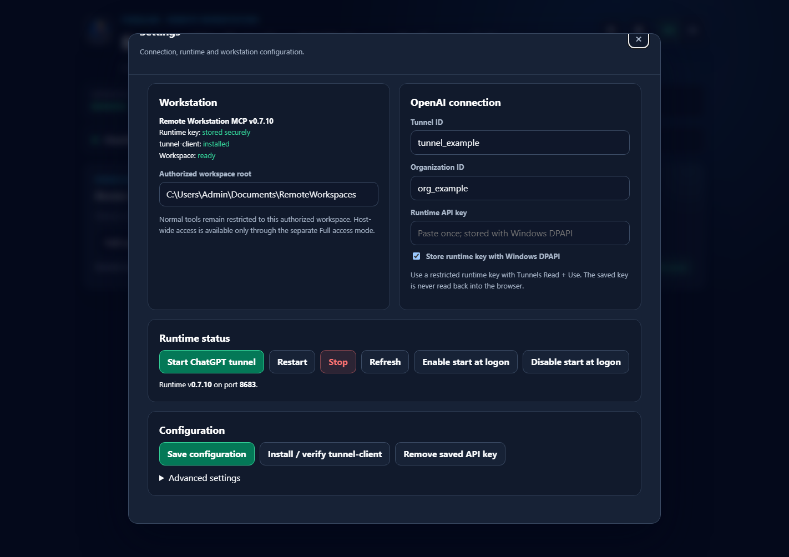
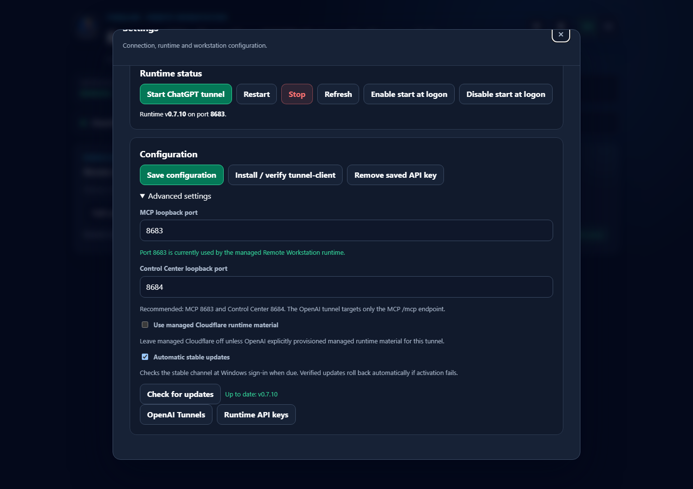

# Windows managed runtime

Remote Workstation MCP v0.7.10 supports a managed one-time Windows installation for normal users and a separate source-repository workflow for contributors.

## One-time managed install

Download `install-windows.cmd` from the latest GitHub Release and run it once.

The managed installer:

1. checks prerequisites and can install Node.js LTS and Git through `winget` when missing;
2. resolves the selected stable GitHub Release;
3. downloads the package and `SHA256SUMS.txt`;
4. verifies SHA-256 before extraction;
5. installs the application into a version slot;
6. installs/verifies the pinned OpenAI `tunnel-client`;
7. creates the stable launcher and Start Menu shortcut;
8. creates/preserves stable `current.txt` and `previous.txt` pointers;
9. initializes stable automatic updates;
10. opens the local Control Center.

A normal user does not need a Git checkout, `npm install`, or a manual rebuild for production use.

## Installed layout

```text
%LOCALAPPDATA%\RemoteWorkstationMCP\
  bin\
    rwmcp.ps1
    install-windows-release.ps1
    update-windows.ps1
  config\
    policy.yaml
    hosts.yaml
  runtime\
    supervisor.json
    control-center.json
    ...logs and operational state...
  audit\
  secrets\
    openai-runtime-api-key.dpapi
  versions\
    v0.7.9\
    v0.7.10\
  current.txt
  previous.txt
  settings.json
  update.json
```

Application version slots are disposable/replaceable. Owner configuration, update state, audit data, and DPAPI-protected secrets live outside the slots.

Do not edit `%LOCALAPPDATA%\RemoteWorkstationMCP\versions\...` as a source repository. Development changes belong in a Git checkout.

## Stable launcher

Managed installs create:

```text
%LOCALAPPDATA%\RemoteWorkstationMCP\bin\rwmcp.ps1
```

Supported launcher actions in v0.7.10 are:

```text
Setup
Start
StartOpenAI
Boot
Stop
Restart
Status
AutostartOn
AutostartOff
UpdateCheck
AutoUpdateOn
AutoUpdateOff
Update
Rollback
```

Examples:

```powershell
$ctl = "$env:LOCALAPPDATA\RemoteWorkstationMCP\bin\rwmcp.ps1"
& $ctl -Action Status
& $ctl -Action UpdateCheck
& $ctl -Action Update
& $ctl -Action Rollback
```

## Automatic startup

RWMCP start-at-logon uses the current-user registry path:

```text
HKCU\Software\Microsoft\Windows\CurrentVersion\Run
```

The registered command targets the stable launcher and uses:

```text
-Action Boot
```

The launcher remains stable while `current.txt` moves between application version slots.

Boot flow:

```text
Windows user signs in
  -> stable launcher runs Boot
  -> check stable update if due
  -> start managed MCP runtime
  -> start/reconnect OpenAI tunnel
  -> verify MCP health + tunnel readiness
```

This startup path is non-elevated and runs with the permissions of the signed-in Windows user.

## Automatic update

Managed Windows installs default to:

```json
{
  "enabled": true,
  "channel": "stable",
  "checkOnStartup": true,
  "checkIntervalHours": 12
}
```

GitHub Releases are the production distribution source. Production update does not run `git pull` against a source tree.

Update flow:

1. check the stable GitHub Release channel when due;
2. download the release package and checksum manifest;
3. verify SHA-256;
4. install the candidate into a new version slot;
5. switch the current pointer;
6. start the candidate;
7. verify MCP health and OpenAI tunnel readiness;
8. keep the candidate if healthy;
9. otherwise mark the failed release, restore the previous pointer, and start the previous known-good slot.

Network/update-check failure is non-fatal; the already-installed runtime still starts.

Manual maintenance:

```powershell
& $ctl -Action UpdateCheck
& $ctl -Action Update
& $ctl -Action AutoUpdateOn
& $ctl -Action AutoUpdateOff
& $ctl -Action Rollback
```

## Control Center

Default owner UI:

```text
http://127.0.0.1:8684/
```

Default MCP endpoint:

```text
127.0.0.1:8683
```

The Control Center is loopback-only and separate from the MCP/tunnel runtime. Closing the browser window does not stop the runtime.

The production v0.7.10 Settings modal currently contains:

- Quick setup for ChatGPT;
- Workstation;
- OpenAI connection;
- Runtime status;
- Configuration;
- Advanced settings.

Advanced settings includes the MCP/Control Center ports, managed runtime option, **Automatic stable updates**, and **Check for updates**.





## Access mode and Administrator boundary

The three user-facing access modes are:

- **Read only** - inspect only;
- **Workspace** - read/write/execute approved workflows inside owner-authorized workspaces;
- **Full access** - host filesystem + raw shell as the current Windows user.

Full Access does not grant Administrator privileges.

Administrator flow:

```text
AI creates admin request
  -> local Control Center shows exact request
  -> owner approves once
  -> Windows RunAs/UAC
  -> isolated helper executes the approved direct program
```

The normal MCP, tunnel, and Control Center remain non-elevated.

## v0.7.10 Control Center port ownership hardening

The default Control Center port is `8684`.

v0.7.10 no longer treats any listener on `8684` as a healthy Control Center. The supervisor verifies that the listener belongs to the managed Control Center process tree.

If another process owns the configured Control Center port:

- RWMCP does not report a false healthy/READY state;
- the conflict is reported with the owning PID/process context;
- close the conflicting application or choose another Control Center port in Advanced settings;
- then restart/reopen the managed Control Center.

Useful diagnostics:

```powershell
Get-NetTCPConnection -State Listen -LocalPort 8684
Get-Process -Id <PID>
```

## Health and status

Stable launcher status:

```powershell
& $ctl -Action Status
```

Direct MCP health:

```powershell
Invoke-RestMethod http://127.0.0.1:8683/healthz
```

Expected healthy production state includes version `0.7.10`, an active loopback MCP listener, bearer auth for the OpenAI tunnel path, and tunnel readiness when OpenAI mode is running.

## Troubleshooting

### Control Center does not open

Check whether `8684` is listening and who owns it. v0.7.10 intentionally rejects a foreign listener instead of reporting it healthy.

### MCP healthy but ChatGPT is not connected

Run `Status` and check `tunnelReady`. The workstation MCP stays loopback-only; ChatGPT Web reaches it through the outbound OpenAI Secure MCP Tunnel.

### Update fails

The existing slot should still boot. If a newly installed candidate fails activation health/readiness checks, the stable launcher restores the previous slot automatically.

### Startup is disabled

Re-enable it with:

```powershell
& $ctl -Action AutostartOn
```

### Open Control Center manually

```powershell
& $ctl -Action Setup
```

## Repository development

For contributors only:

```powershell
git clone https://github.com/Tunglam0605/remote-workstation-mcp.git
cd remote-workstation-mcp
npm install
npm run typecheck
npm test
npm run build
```

Repository development is intentionally separate from the managed production installation.